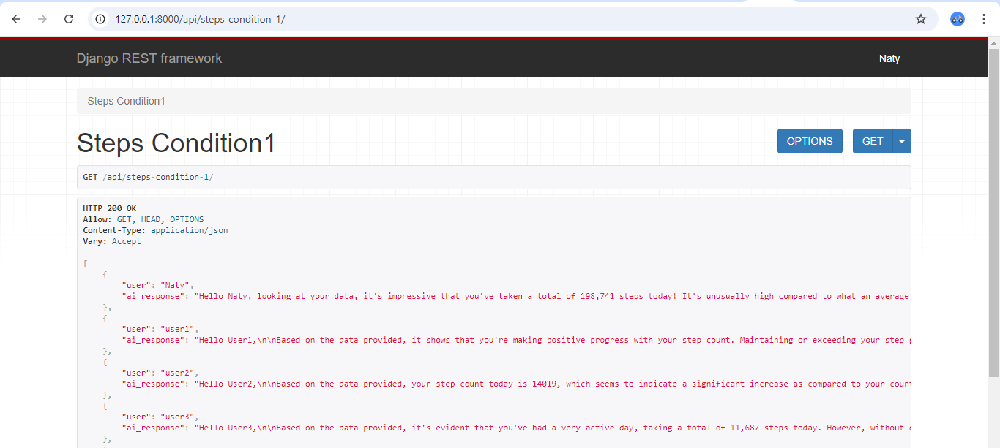
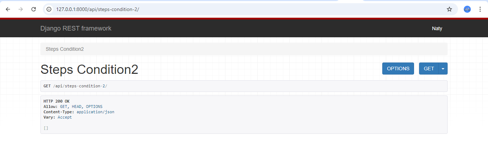

# AppleHealthAI

## 1. What the Project Is

**AppleHealthAI** is a Django-based project that integrates with OpenAI to provide personalized health advice to users based on their Apple Health data. The platform generates recommendations for users based on their sleep patterns, physical activity, and other health metrics. The project uses OpenAI's GPT models to generate these personalized responses, and it features an API that allows users to access health advice in real-time.

### Key Features:
- **Health Data Insights**: Users' Apple Health data is analyzed to provide insights and advice.
- **OpenAI Integration**: GPT-3.5 or GPT-4 models are used to generate personalized health suggestions.
- **Django API**: The project exposes an API that provides users with personalized advice based on their health metrics.
- **Custom Commands**: The project includes custom Django commands to generate random user health data.

---

## 2. How to Clone and Run the Project

### Step 1: Clone the Repository

To get started, clone the repository to your local machine using the following command:

```bash
git clone https://github.com/your-username/AppleHealthAI.git
```

### Step 2: Set Up the Environment

Navigate into the project directory:

```bash
cd AppleHealthAI
```

Install Python dependencies using pip. It is recommended to create a virtual environment first:

```bash
python -m venv env #or your ways of creating virtual environment

# Activate the virtual environment

# For macOS/Linux:
source env/bin/activate

# For Windows:
.\env\Scripts\activate

# Install the required dependencies
pip install -r requirements.txt
```

Set up your environment variables in a .env file at the root of the project:

```bash
touch .env
```

Inside your .env file, add the following:
```bash
OPENAI_API_KEY=your-openai-api-key
```

### Step 3: Run Database Migrations

Before running the project, apply the necessary database migrations:

```bash
python manage.py migrate
```

### Step 4: Generate Random Data

You can generate random user health data using the custom management command:

```bash
python manage.py generate_random_data
```
This will create random Apple Health data for users, which can then be used for testing the API.

### Step 5: Start the Django Development Server

Once everything is set up, run the Django development server:

```bash
python manage.py runserver
```

The server will start at http://127.0.0.1:8000/.

## 3. API Requests and Responses

The project provides several API endpoints to retrieve user-specific health advice based on their Apple Health data.

### Example: /api/steps-condition-1/ Endpoint

This endpoint returns advice for users who have walked more than 10,000 steps today.

Request:

```bash
GET http://127.0.0.1:8000/api/steps-condition-1/
```

Response

```bash
{
  "user": "john_doe",
  "ai_response": "Wow, that's an outstanding hike in your physical activity compared to yesterday! It's great to see you active, but it's also important to listen to your body. ..."
}
```

### Example: /api/sleep-condition/ Endpoint

This endpoint returns advice for users who have had less than 6 hours of sleep in the past week.

Request:

```bash
GET http://127.0.0.1:8000/api/sleep-condition/
```

Response:

```bash
{
  "user": "jane_doe",
  "ai_response": "It looks like you haven't been getting enough sleep recently. Prioritizing your rest is important for your overall health. Aim for at least 7-8 hours of sleep every night. ..."
}
```

## 4. Potential Results

### Example Screenshot: API Requests using chrome browser

